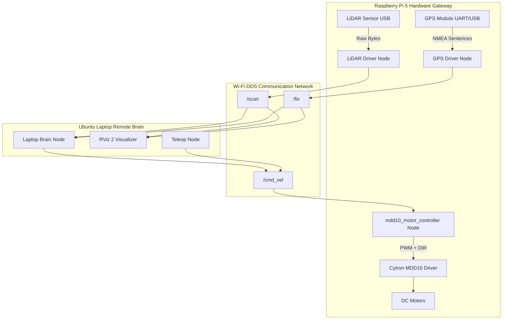
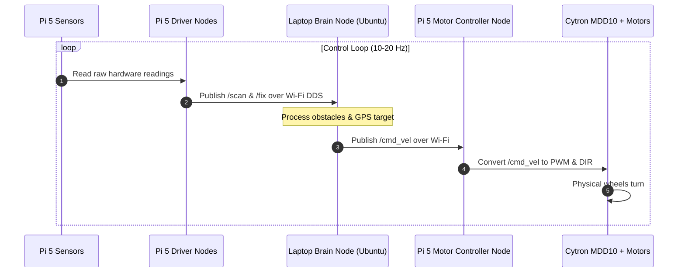
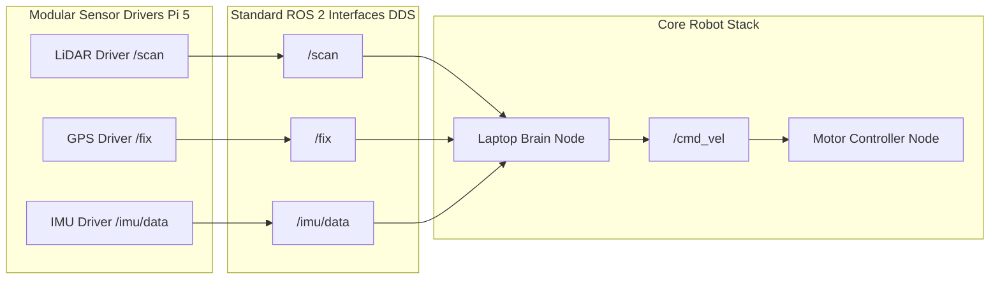

# Remote-Brain & Modular Architecture Guide

This document details the **Remote-Brain Offloaded Compute Architecture** and **Modular Hardware Interface Pattern** used in the ROS 2 Cone Robot workspace.

---

## 1. Architectural Concept: Remote-Brain Offloading

In this architecture, heavy computational tasks (path planning, sensor fusion, computer vision, obstacle avoidance) are offloaded from the robot's onboard microcontroller to a powerful remote machine (Ubuntu Laptop).

- **Raspberry Pi 5 (Hardware I/O Gateway)**:
  - Connects directly to physical hardware sensors (LiDAR, GPS, IMU) and motor drivers.
  - Runs lightweight ROS 2 driver nodes that broadcast raw sensor data onto the ROS 2 DDS network over Wi-Fi.
  - Subscribes to `/cmd_vel` to drive the Cytron MDD10 motor controller GPIO pins.
  - Includes a fail-safe Watchdog Timer that automatically stops physical motors if network connectivity drops.

- **Ubuntu Laptop (The Remote Brain)**:
  - Subscribes to sensor streams (`/scan`, `/fix`) over Wi-Fi.
  - Computes navigation logic, target distances, and steering angles.
  - Publishes target velocity commands (`/cmd_vel`) back to the Raspberry Pi 5.
  - Runs real-time visualizers like **RViz 2**.

---

## 2. Complete System & Network Data Flow Diagram

```text
+---------------------------------------------------------------------------------------+
|                         RASPBERRY PI 5 (Hardware I/O Gateway)                         |
|                                                                                       |
|  [LiDAR Sensor] --------> (LiDAR Driver Node) -------\                                |
|  [GPS Module]   --------> (GPS Driver Node)   --------\                               |
|                                                        |                              |
|  [DC Motors] <--- [MDD10 Driver] <--- (Motor Controller Node)                         |
+--------------------------------------------------------|------------------------------+
                                                         |
                                 Wi-Fi DDS Network       | Publish /scan & /fix
                                 (ROS_DOMAIN_ID = 42)    v
+---------------------------------------------------------------------------------------+
|                         UBUNTU LAPTOP (The Remote Brain)                              |
|                                                                                       |
|  (Laptop Brain Node) <---------------------------------/                              |
|       |                                                                               |
|       | Computes path & obstacle avoidance                                            |
|       v                                                                               |
|  Publishes /cmd_vel over Wi-Fi DDS -------------------> (Motor Controller Node)       |
|                                                                                       |
|  (RViz 2 Visualizer) <--- Subscribes to /scan & /fix                                  |
|  (Teleop Control)   ---> Publishes manual /cmd_vel                                    |
+---------------------------------------------------------------------------------------+
```

<details>
<summary>View Mermaid Diagram</summary>



</details>

---

## 3. Continuous Execution & Control Loop Sequence

```text
Pi 5 Hardware           Pi 5 Driver Nodes       Ubuntu Laptop Brain     Motor Controller (Pi 5)     Motors
      |                         |                        |                         |                   |
      |--- Read Sensor Data --->|                        |                         |                   |
      |                         |--- Publish /scan ---->|                         |                   |
      |                         |--- Publish /fix ----->|                         |                   |
      |                         |                        |-- Calculate Navigation -|                   |
      |                         |                        |-- Publish /cmd_vel ---->|                   |
      |                         |                        |                         |-- PWM & DIR ----->|
      |                         |                        |                         |                   | (Motors Turn)
```

<details>
<summary>View Mermaid Sequence Diagram</summary>



</details>

---

## 4. Modular "Plug-and-Play" Sensor Integration Pattern

Sensors and motor controllers interact exclusively through standard ROS 2 message topics. Adding or removing a hardware module requires **zero code changes** to existing nodes:

```text
+------------------------+       +------------------------+       +------------------------+
|  MODULAR SENSOR NODES  |       |   STANDARD DDS TOPICS  |       |    CORE ROBOT STACK    |
|       (Pi 5)           |       |                        |       |                        |
|  [LiDAR Driver] -------+------>|  /scan                 +------>| [Laptop Brain Node]    |
|  [GPS Driver]   -------+------>|  /fix                  +------>|        |               |
|  [IMU Driver]   -------+------>|  /imu/data             +------>|        v               |
+------------------------+       +------------------------+       |     /cmd_vel           |
                                                                  |        v               |
                                                                  | [Motor Controller Node]|
                                                                  +------------------------+
```

<details>
<summary>View Mermaid Diagram</summary>



</details>

---

## 5. ROS 2 Topic & Interface Registry

| Topic Name | ROS 2 Message Type | Publisher Location | Subscriber Location | Purpose |
| :--- | :--- | :--- | :--- | :--- |
| `/cmd_vel` | `geometry_msgs/msg/Twist` | Laptop Brain / Teleop Node | `mdd10_motor_controller` (RPi 5) | Target linear velocity ($v_x$) and angular turning rate ($\omega_z$). |
| `/scan` | `sensor_msgs/msg/LaserScan` | LiDAR Driver Node (RPi 5) | Laptop Brain Node / RViz 2 | 2D 360° obstacle distance measurements. |
| `/fix` | `sensor_msgs/msg/NavSatFix` | GPS Driver Node (RPi 5) | Laptop Brain Node / EKF | Global latitude, longitude, and altitude coordinates. |
| `/imu/data` | `sensor_msgs/msg/Imu` | IMU Driver Node (RPi 5) | Laptop Brain Node / EKF | 3-axis acceleration & angular velocity. |
| `/tf` | `tf2_msgs/msg/TFMessage` | `robot_state_publisher` (RPi 5) | RViz 2 (Laptop) | Coordinate frame transformations (`base_link` $\rightarrow$ `laser`, `gps`, etc.). |

---


