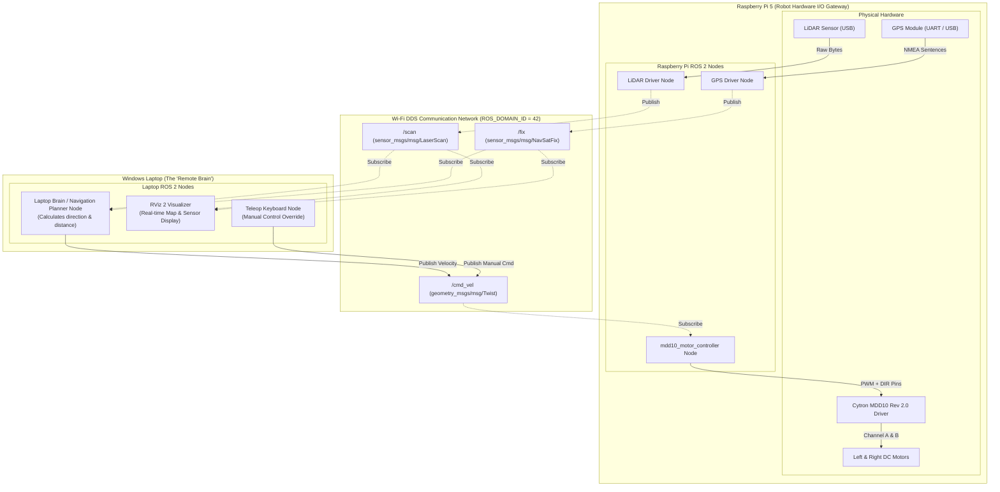
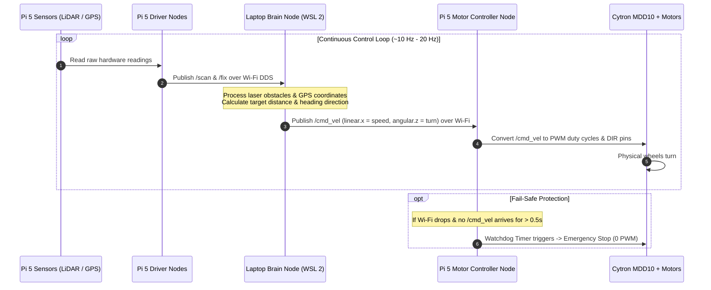
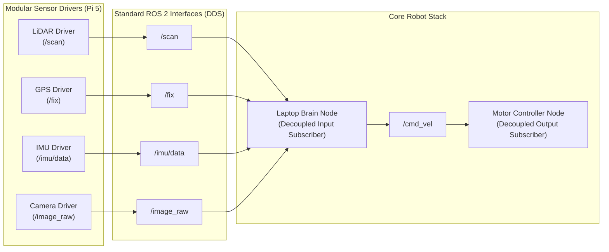

# Remote-Brain & Modular Architecture Guide

This document details the **Remote-Brain Offloaded Compute Architecture** and **Modular Hardware Interface Pattern** used in the ROS 2 Cone Robot workspace.

---

## 1. Architectural Concept: Remote-Brain Offloading

In this architecture, heavy computational tasks (path planning, sensor fusion, computer vision, obstacle avoidance) are offloaded from the robot's onboard microcontroller to a powerful remote machine (Windows Laptop running WSL 2).

- **Raspberry Pi 5 (Hardware I/O Gateway)**:
  - Connects directly to physical hardware sensors (LiDAR, GPS, Camera, IMU) and motor drivers.
  - Runs lightweight ROS 2 driver nodes that broadcast raw sensor data onto the ROS 2 DDS network over Wi-Fi.
  - Subscribes to `/cmd_vel` to drive the Cytron MDD10 motor controller GPIO pins.
  - Includes a fail-safe Watchdog Timer that automatically stops physical motors if network connectivity drops.

- **Windows Laptop in WSL 2 (The Remote Brain)**:
  - Subscribes to sensor streams (`/scan`, `/fix`, `/camera/image_raw`) over Wi-Fi.
  - Computes navigation logic, target distances, and steering angles.
  - Publishes target velocity commands (`/cmd_vel`) back to the Raspberry Pi 5.
  - Runs real-time visualizers like **RViz 2**.

---

## 2. Complete System & Network Data Flow Diagram



---

## 3. Continuous Execution & Control Loop Sequence



---

## 4. Modular "Plug-and-Play" Sensor Integration Pattern

Sensors and motor controllers interact exclusively through standard ROS 2 message topics. Adding or removing a hardware module requires **zero code changes** to existing nodes:



---

## 5. ROS 2 Topic & Interface Registry

| Topic Name | ROS 2 Message Type | Publisher Location | Subscriber Location | Purpose |
| :--- | :--- | :--- | :--- | :--- |
| `/cmd_vel` | `geometry_msgs/msg/Twist` | Laptop Brain / Teleop Node | `mdd10_motor_controller` (RPi 5) | Target linear velocity ($v_x$) and angular turning rate ($\omega_z$). |
| `/scan` | `sensor_msgs/msg/LaserScan` | LiDAR Driver Node (RPi 5) | Laptop Brain Node / RViz 2 | 2D 360° obstacle distance measurements. |
| `/fix` | `sensor_msgs/msg/NavSatFix` | GPS Driver Node (RPi 5) | Laptop Brain Node / EKF | Global latitude, longitude, and altitude coordinates. |
| `/imu/data` | `sensor_msgs/msg/Imu` | IMU Driver Node (RPi 5) | Laptop Brain Node / EKF | 3-axis acceleration & angular velocity. |
| `/camera/image_raw` | `sensor_msgs/msg/Image` | Camera Node (RPi 5) | Laptop Vision Node | Raw video frames for object/cone detection. |
| `/tf` | `tf2_msgs/msg/TFMessage` | `robot_state_publisher` (RPi 5) | RViz 2 (Laptop) | Coordinate frame transformations (`base_link` $\rightarrow$ `laser`, `gps`, etc.). |

---

## 6. Laptop Brain Node Implementation Template

Below is a clean Python ROS 2 template for creating your **Laptop Brain Node**. It subscribes to sensor topics coming from the Pi 5 over Wi-Fi, computes movement decisions, and publishes velocity commands to `/cmd_vel`:

```python
#!/usr/bin/env python3
"""
Template ROS 2 Laptop Brain Node
Runs on Laptop (WSL 2) to process Pi 5 sensor streams and control robot movement.
"""

import rclpy
from rclpy.node import Node
from geometry_msgs.msg import Twist
from sensor_msgs.msg import LaserScan, NavSatFix


class LaptopBrainNode(Node):

    def __init__(self):
        super().__init__('laptop_brain_node')

        # --- Publishers ---
        # Sends velocity commands to Raspberry Pi 5 motor controller
        self.cmd_pub = self.create_publisher(Twist, '/cmd_vel', 10)

        # --- Subscribers ---
        # Subscribes to LiDAR scan data from Raspberry Pi 5
        self.scan_sub = self.create_subscription(
            LaserScan,
            '/scan',
            self.scan_callback,
            10
        )

        # Subscribes to GPS fix data from Raspberry Pi 5
        self.gps_sub = self.create_subscription(
            NavSatFix,
            '/fix',
            self.gps_callback,
            10
        )

        self.get_logger().info("Laptop Brain Node initialized and listening to Pi 5 sensors...")

    def scan_callback(self, msg: LaserScan):
        """Processes LiDAR scan data arriving over Wi-Fi from Pi 5."""
        # Example: Find minimum obstacle distance in front of robot
        min_distance = min([r for r in msg.ranges if r > 0.0] or [10.0])
        self.get_logger().info(f"Front obstacle distance: {min_distance:.2f} m")

        # Calculate movement decision
        cmd = Twist()
        if min_distance < 0.5:
            # Obstacle detected closer than 0.5m -> Stop and Turn Right
            cmd.linear.x = 0.0
            cmd.angular.z = -0.5
            self.get_logger().warn("Obstacle near! Turning right...")
        else:
            # Clear path -> Move forward
            cmd.linear.x = 0.3
            cmd.angular.z = 0.0

        # Publish command back to Pi 5
        self.cmd_pub.publish(cmd)

    def gps_callback(self, msg: NavSatFix):
        """Processes GPS coordinates arriving over Wi-Fi from Pi 5."""
        self.get_logger().info(f"GPS Fix -> Lat: {msg.latitude:.6f}, Lon: {msg.longitude:.6f}")


def main(args=None):
    rclpy.init(args=args)
    node = LaptopBrainNode()
    try:
        rclpy.spin(node)
    except KeyboardInterrupt:
        pass
    finally:
        # Publish zero velocity before exit
        stop_cmd = Twist()
        node.cmd_pub.publish(stop_cmd)
        node.destroy_node()
        rclpy.shutdown()


if __name__ == '__main__':
    main()
```
