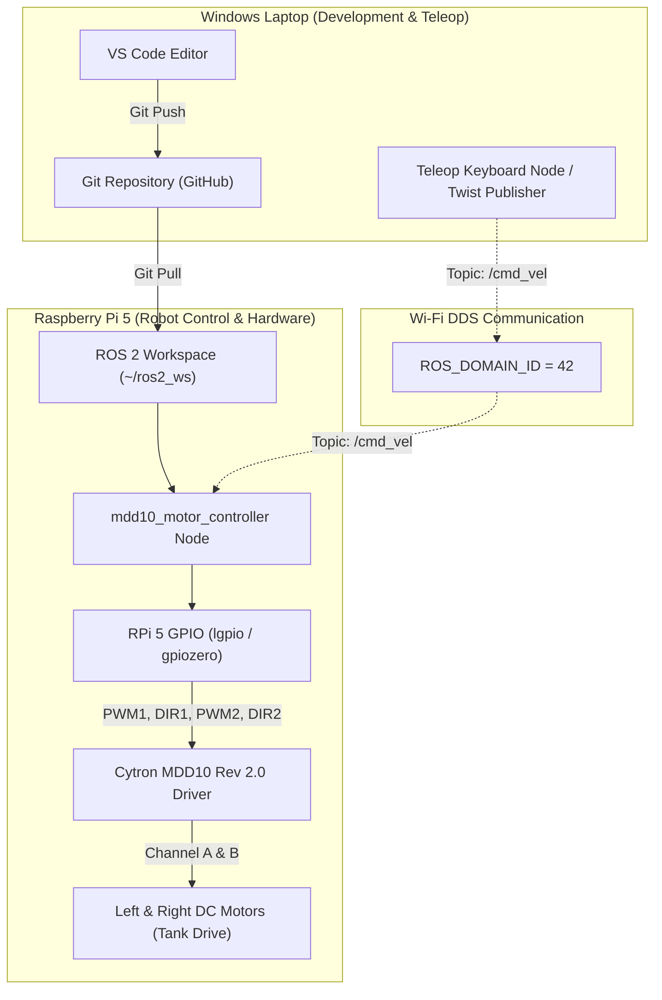

# Development Architecture & Kinematics Guide

This document details the software architecture, node interfaces, kinematics mathematics, and configuration schema for the **Cone Robot** ROS 2 control system.

---

## 1. System Architecture Diagram



---

## 2. Differential Drive Kinematics (Tank Steering)

The robot uses standard two-wheel differential drive (tank steering) kinematics. The motor controller converts `/cmd_vel` inputs into left and right wheel velocities using the formula:

$$v_{\text{left}} = v_x - \left(\frac{\omega_z \cdot L}{2}\right)$$

$$v_{\text{right}} = v_x + \left(\frac{\omega_z \cdot L}{2}\right)$$

Where:
- $v_x$ = Linear velocity target ($\text{m/s}$) from `/cmd_vel.linear.x`
- $\omega_z$ = Angular velocity target ($\text{rad/s}$) from `/cmd_vel.angular.z`
- $L$ = Wheel track width ($\text{meters}$) from `wheel_track` parameter in `robot_config.yaml`

### Duty Cycle Normalization

Linear wheel velocities ($v_{\text{left}}, v_{\text{right}}$) are normalized relative to `max_linear_speed` to obtain duty cycle ratios in the range $[-1.0, 1.0]$:

$$\text{Duty}_{\text{left}} = \text{clamp}\left(\frac{v_{\text{left}}}{v_{\text{max}}}, -1.0, 1.0\right)$$

$$\text{Duty}_{\text{right}} = \text{clamp}\left(\frac{v_{\text{right}}}{v_{\text{max}}}, -1.0, 1.0\right)$$

- Positive duty cycle $\rightarrow$ Direction Pin = `HIGH` (Forward)
- Negative duty cycle $\rightarrow$ Direction Pin = `LOW` (Reverse)
- Absolute magnitude $|\text{Duty}|$ $\rightarrow$ Speed PWM Duty Cycle ($0.0 \dots 1.0$)

---

## 3. Node Descriptions

### A. `mdd10_motor_controller`
- **Source**: [`mdd10_motor_controller.py`](file:///wsl$/Ubuntu-24.04/home/bandi/github/conerobot/ConeRobot/src/cone_robot_control/cone_robot_control/mdd10_motor_controller.py)
- **Subscribes to**: `/cmd_vel` (`geometry_msgs/msg/Twist`)
- **Parameters**: Defined in `config/robot_config.yaml`.
- **Features**:
  - Automatically falls back to mock hardware mode if `gpiozero` is missing or `mock_hardware: true` is passed.
  - Fail-safe Watchdog Timer: automatically zeroes motor speeds if no `/cmd_vel` commands arrive within `cmd_timeout` seconds (default 0.5s).

### B. `teleop_keyboard`
- **Source**: [`teleop_keyboard.py`](file:///wsl$/Ubuntu-24.04/home/bandi/github/conerobot/ConeRobot/src/cone_robot_control/cone_robot_control/teleop_keyboard.py)
- **Publishes to**: `/cmd_vel` (`geometry_msgs/msg/Twist`)
- **Features**: Cross-platform terminal keyboard input (`W`/`A`/`S`/`D` speed incrementing, `SPACE`/`K` emergency stop, `Q`/`Z` step size adjustments).

### C. `simple_publisher`
- **Source**: [`simple_publisher.py`](file:///wsl$/Ubuntu-24.04/home/bandi/github/conerobot/ConeRobot/src/cone_robot_control/cone_robot_control/simple_publisher.py)
- **Publishes to**: `/cmd_vel` (`geometry_msgs/msg/Twist`)
- **Features**: Test script executing a hardcoded motion sequence (Forward $\rightarrow$ Turn Left $\rightarrow$ Turn Right $\rightarrow$ Stop).

---

## 4. Configuration Reference: `config/robot_config.yaml`

```yaml
mdd10_motor_controller:
  ros__parameters:
    pwm1_pin: 12           # Left Motor Speed PWM (GPIO 12)
    dir1_pin: 24           # Left Motor Direction (GPIO 24)
    pwm2_pin: 13           # Right Motor Speed PWM (GPIO 13)
    dir2_pin: 25           # Right Motor Direction (GPIO 25)

    wheel_track: 0.20      # Track width between wheels in meters
    max_linear_speed: 1.0  # Max linear speed (m/s)
    max_angular_speed: 3.0 # Max angular speed (rad/s)
    cmd_timeout: 0.5       # Fail-safe timeout in seconds
    mock_hardware: false   # Enable dry-run mode without GPIO
```
