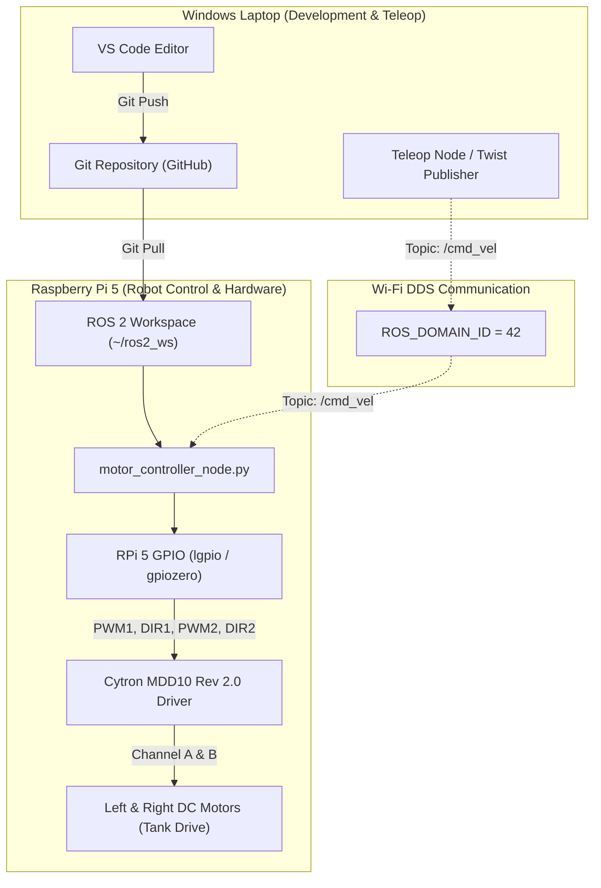

# ROS 2 Raspberry Pi 5 & Windows Laptop Control Setup Plan

This plan establishes a ROS 2 (Jazzy) control environment using **Python (`ament_python`)**, a **Git-based workflow**, **distributed ROS 2 DDS communication**, and hardware motor control using the **Cytron MDD10 Rev 2.0** dual-channel DC motor driver in tank/skid steering mode.

## Architecture & Workflow (Windows Laptop + RPi 5)

---

## Hardware Control Specifications: Cytron MDD10 Rev 2.0

The **Cytron MDD10 Rev 2.0** is a 10A dual-channel DC motor driver supporting **Tank (Differential) Steering**.

### Control Pin Mapping (Raspberry Pi 5)
Using standard **PWM + DIR** sign-magnitude control mode:
- **Left Motor (Channel A)**:
  - `PWM1`: GPIO Pin (Speed control via PWM frequency)
  - `DIR1`: GPIO Pin (High = Forward, Low = Reverse)
- **Right Motor (Channel B)**:
  - `PWM2`: GPIO Pin (Speed control via PWM frequency)
  - `DIR2`: GPIO Pin (High = Forward, Low = Reverse)

> [!NOTE]
> On Raspberry Pi 5 (Ubuntu 24.04 Noble), traditional `RPi.GPIO` is deprecated due to the new RP1 peripheral chip. We will use **`gpiozero` with the `lgpio` backend** or hardware PWM for smooth motor speed control.

---

## Proposed Changes

### Repository Configuration & Workspace Structure

#### [NEW] [.gitignore](file:///c:/Users/Bandi/Egyetem/cone%20robot/ros2v1/.gitignore)
- Ignore ROS 2 build artifacts (`build/`, `install/`, `log/`), Python byte code (`__pycache__`, `*.pyc`), and IDE settings.

#### [NEW] [README.md](file:///c:/Users/Bandi/Egyetem/cone%20robot/ros2v1/README.md)
- Complete documentation:
  - Git sync workflow from Windows Laptop to RPi 5.
  - Setting up SSH connection from Windows PowerShell.
  - Setting `ROS_DOMAIN_ID=42` on both devices.
  - RPi 5 Swap Memory creation (protecting 1GB RAM against out-of-memory errors).
  - Cytron MDD10 Rev 2.0 wiring diagram & GPIO setup.

---

### Package: `cone_robot_control`

#### [NEW] `src/cone_robot_control/package.xml`
- Package dependencies: `rclpy`, `geometry_msgs`, `std_msgs`.

#### [NEW] `src/cone_robot_control/setup.py`
- Package setup registering executable nodes (`mdd10_motor_controller`, `teleop_keyboard`).

#### [NEW] `src/cone_robot_control/setup.cfg`
- Executable build output configuration for `colcon`.

#### [NEW] `src/cone_robot_control/cone_robot_control/__init__.py`
- Package init.

#### [NEW] `src/cone_robot_control/cone_robot_control/mdd10_motor_controller.py`
- ROS 2 node designed for Raspberry Pi 5:
  - Subscribes to `/cmd_vel` (`geometry_msgs/msg/Twist`).
  - Implements Tank Steering differential drive kinematics:
    $$v_{\text{left}} = v_x - \frac{\omega_z \cdot W}{2}$$
    $$v_{\text{right}} = v_x + \frac{\omega_z \cdot W}{2}$$
  - Normalizes motor speeds to $[-1.0, 1.0]$.
  - Interfaces directly with Cytron MDD10 Rev 2.0 using `gpiozero` / PWM+DIR pins.
  - Includes configurable GPIO parameters (Pins for PWM1, DIR1, PWM2, DIR2, wheel track width, max speed).
  - Safety fail-safe: automatically stops motors if `/cmd_vel` messages stop arriving (timeout handling).

#### [NEW] `src/cone_robot_control/cone_robot_control/teleop_keyboard.py`
- Lightweight Python keyboard controller to run from laptop / terminal for testing forward, reverse, turning, and emergency stop.

---

## Verification Plan

### Automated & Static Verification
1. **Python Syntax & ROS 2 Linting**: Verify clean Python 3 syntax and standard `rclpy` node structure.

### Hardware & Network Verification
1. **Cytron MDD10 Pin Dry-Run Test**:
   - Run node on RPi 5 with parameter `--ros-args -p mock_hardware:=true` to test ROS 2 logic before powering physical motors.
2. **Network DDS `/cmd_vel` Test**:
   - Send velocity commands from laptop: `ros2 topic pub /cmd_vel geometry_msgs/msg/Twist ...`
   - Observe motor output and PWM/DIR pin responses on RPi 5.
